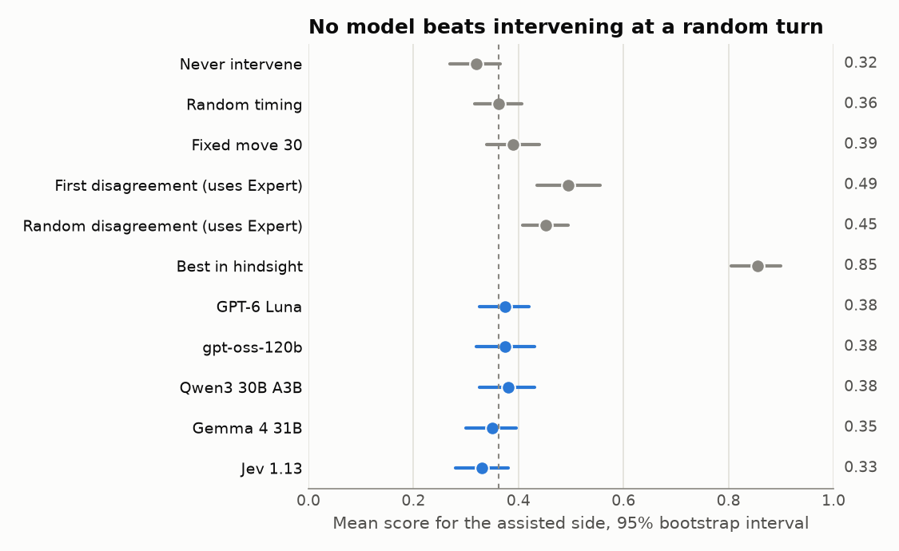
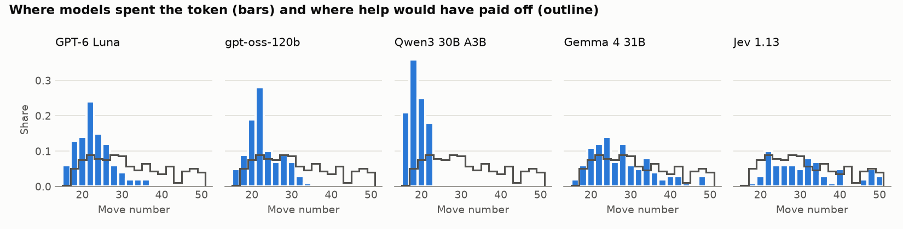

# Chess Intervention Benchmark

**Can a language model tell when a chess player should think harder?**

Two equal chess engines play. Once per game, a language model may tell one side to think longer about its next move: that move is searched to depth 18 instead of 12. The model never sees a move or an evaluation, only the game so far. It is scored on the game's final result.

**No model beat choosing the moment at random.** The analysis below explains why:
the benchmark mostly rewards predicting where a deeper engine search would pick a
different move, which a model cannot see from the board. This repository holds
the whole experiment (data generation, an [Inspect](https://inspect.aisi.org.uk/)
task, the model settings and the analysis) as a worked example of designing,
running and diagnosing an evaluation, including a negative result.



## Motivation

Magnus Carlsen has said that a signal telling him when a position is critical,
without telling him the move, would make him "practically unbeatable"
([The Joe Rogan Experience #2275, at 2:09:56](https://podcasts.happyscribe.com/the-joe-rogan-experience/2275-magnus-carlsen)).
The same question matters for AI oversight: a supervisor that cannot do the
work itself may still be useful if it knows *when* to call for help. Chess makes
the question measurable, because every choice can be played out.

## The task

- **Players.** Stockfish 17.1 at search depth 12 plays both sides: the *Worker*
  plays the assisted side and the *Opponent* the other. The *Expert* is the same
  engine at depth 18.
- **Openings.** Each game starts from the first 15 to 20 moves of a real game from
  the [Lichess Elite Database](https://database.nikonoel.fr/) (players rated
  2400+ against 2200+), kept only if the position is within 1.5 pawns.
- **Decisions.** Before every assisted-side move up to move 50, the model sees
  the board, the FEN, the full move history and the rules, and answers
  `continue_play` or `use_expert_move`. It never sees either engine's move,
  evaluations or the rest of the game. The token is spent even if the Expert
  picks the Worker's move.
- **Score.** 1 for a win, 0.5 for a draw and 0 for a loss, for the assisted side.

Every possible choice is played out in advance: the unassisted game, and one full
game for each turn at which the model could intervene. Evaluating a model
therefore needs no engine, and every score traces back to a saved game.

The 100 episodes are those where **some** intervention improves the result, so
there is always a right moment to find. That makes this a test of timing, and it
means the unassisted side never wins.

### One episode

Episode `elite-2020-05-143476-black` starts from a Slav Defense after 15 moves,
and the model supervises Black. There are 35 decisions (moves 16 to 50). The
Expert would play a different move on 11 of them, and only one intervention
changes the result:

| | Black's move 29 | Result |
| --- | --- | --- |
| Unassisted | Worker plays ...a5 | Black is checkmated on move 55 (score 0) |
| Intervene at move 29 | Expert plays ...h6 | Draw by threefold repetition on move 53 (score 0.5) |

The models intervened at move 30 (GPT-6 Luna), 17 (gpt-oss-120b), 16 (Qwen3),
26 (Gemma 4) and 27 (Jev). All scored 0.

## Results

Five models on the same 100 episodes, one run each. Intervals are 95% paired
bootstrap intervals over source games ([full tables](results/results.md)).

| Policy | Mean score | Minus random timing [95% CI] |
| --- | --- | --- |
| Never intervene | 0.320 | −0.043 [−0.053, −0.034] |
| **Random timing** | **0.363** | 0 |
| Fixed move 30 | 0.390 | +0.027 [−0.004, 0.060] |
| First disagreement *(knows where the Expert differs)* | 0.495 | +0.132 [0.074, 0.192] |
| Best in hindsight | 0.855 | +0.492 [0.472, 0.515] |
| GPT-6 Luna | 0.375 | +0.012 [−0.018, 0.046] |
| gpt-oss-120b | 0.375 | +0.012 [−0.026, 0.052] |
| Qwen3 30B A3B Instruct | 0.380 | +0.017 [−0.019, 0.056] |
| Gemma 4 31B | 0.350 | −0.013 [−0.040, 0.018] |
| Jev 1.13 | 0.330 | **−0.033 [−0.048, −0.015]** |

- Four models are indistinguishable from random timing. Jev is worse: in 29
  episodes it never used the token, and never intervening is the worst option
  here.
- Qwen3 does not engage with the task. It intervened at the first or second
  decision in every episode, so its score is simply what intervening early gets.
- GPT-6 Luna was run three times. Its mean score barely moved (0.390, 0.370,
  0.365), but it chose the same turn in all three runs in only 7% of episodes:
  its timing decisions are close to noise.
- The whole study cost about $3.60 in API calls.

## Why the result is null

**Most help changes nothing.** The Expert picks the Worker's move on 66% of turns.
Intervening improves the result on 8.7% of turns and makes it worse on 0.5%.

**The signal is where the engines disagree.** A reference supervisor that
intervenes at the first turn where the Expert's move differs from the Worker's
scores 0.495, a third of the achievable gain, against 0.363 for random timing.
Choosing randomly among only those turns scores 0.452. So most of what the
benchmark rewards is predicting where a depth-18 search picks a different move
from a depth-12 search. That is a property of the engines' search horizons. It
is not what a person means by a critical moment, and a model cannot read it off
the board without, in effect, running the search.

**The models do not find those turns.** They spent the token on an unchanged
move 60 to 82% of the time, against 66% for random timing, and their timing does
not follow where help pays off:



**This is a real null for these models, not just a small sample.** With 100
episodes, the smallest detectable difference from random timing is 0.024 to 0.056,
depending on the model. A supervisor that captured half of the
first-disagreement advantage (+0.066) would have been detected.

**The result of one game is a noisy label.** Each intervention is judged by a
single deterministic engine game. A different move sends the game down a
different path, so a result can change for reasons unrelated to the quality of
that move. Even a perfect judge of critical moments would be scored against this
noise.

## Limitations

- **Selected episodes.** Every episode has a helpful turn, so the scores say
  nothing about how often help matters in ordinary games, or about knowing when
  *not* to ask.
- **One run per model** (three for GPT-6 Luna) at the settings in
  [configs/models](configs/models): medium reasoning effort where available,
  temperature 1 for the OpenRouter models, JSON answers. Other prompts or
  settings could change the numbers, although the diagnosis above caps what any
  supervisor could gain.
- **Engines are not people.** Depth-limited Stockfish plays very differently from
  a human, and search depth is not a rating.
- **Engine builds.** The episodes were generated with the Windows build of
  Stockfish 17.1. Rebuilding 5 of the 100 episodes with the Linux build gave
  identical games, move for move, but the other 95 were not checked.

## What I would change

1. Judge each move locally, by the engine's evaluation of the position it leads
   to, instead of by the result of one game played to the end.
2. Define the label on something a supervisor can perceive. "This move is a
   mistake" can be checked against the board; "a deeper search would disagree"
   cannot.
3. Ask for a probability rather than a single yes/no token, so every decision
   carries information, and include episodes where no help is needed.

## Reproducing the results

Requirements: [uv](https://docs.astral.sh/uv/) 0.11.3+ on Windows or Linux
(x86-64 with AVX2 for generation). Run everything from the repository root.

```bash
uv sync --frozen
uv run python -m unittest discover -s tests -t .   # about a minute
```

The reported numbers are in [results/](results). The Inspect logs behind them are
not published, so reproducing the numbers means rerunning the models (step 4
below). After that, `scripts/5_analyze.py` needs no engine or API key, and
`uv run inspect view --log-dir logs` shows every prompt and answer. To rerun the
whole pipeline:

| Step | Command | Output | Time |
| --- | --- | --- | --- |
| 0 | `uv run python scripts/0_get_stockfish.py` | Stockfish 17.1, SHA-256 checked | minutes |
| 1 | `uv run python scripts/1_sample_openings.py --pgn lichess_elite_2020-05.pgn` | `data/openings.jsonl` | 5 min |
| 2 | `uv run python scripts/2_build_episodes.py --workers 4` | `data/candidates.jsonl`, 400 episodes | about 5 h |
| 3 | `uv run python scripts/3_select_episodes.py` | `data/episodes.jsonl`, 100 episodes | seconds |
| 4 | `uv run python scripts/4_run_models.py` | `logs/<model>/` | 1 to 2 h, about $2.50 |
| 5 | `uv run python scripts/5_analyze.py` | `results/` | seconds |

Step 1 needs `lichess_elite_2020-05.pgn` from the
[Lichess Elite Database](https://database.nikonoel.fr/); its SHA-256 is recorded in
[data/openings.meta.json](data/openings.meta.json). Its output is committed, so
later steps do not need the file. Steps 1 to 3 are deterministic: sampling is
seeded, and every engine search runs at a fixed depth on one thread with the hash
table and search history cleared first, so each move depends only on the game so
far. Step 4 needs API keys in a `.env` file (see [.env.example](.env.example)).
The Luna repeats are
`uv run python scripts/4_run_models.py luna --epochs 3 --log-root logs/repeats`.
Model answers are not deterministic, so a rerun will give slightly different numbers.

### Tests

The tests favour end-to-end checks over unit tests, and use
[Hypothesis](https://hypothesis.readthedocs.io/) to vary the inputs:

- **Pipeline:** random openings are played out with a fake engine, saved,
  evaluated through the Inspect task by a scripted model, and read back by the
  analysis. Every score must equal an independent replay of the game the model's
  choice leads to. Invalid answers are asked again, and an episode that keeps
  failing is excluded instead of scored.
- **Real engine:** a fresh Stockfish process rebuilds an episode move for move,
  and a search does not depend on earlier searches.
- **Frozen data:** all 100 episodes replay legally with their recorded endings.
  Where the Inspect logs exist, `results/` must also regenerate exactly from them.
- Plus the draw rules, scoring and bootstrap invariants, and the provider for
  Jev's choice API.

## Repository layout

```
src/chess_intervention/
  episodes.py   episode records, game-ending rules, replay checks
  engine.py     pinned Stockfish settings; a search that forgets between moves
  generate.py   plays the unassisted game and every intervention
  task.py       the Inspect task: observation, solver, scorer
  policies.py   reference policies scored from the saved games
  stats.py      paired bootstrap and power calculation
  analysis.py   reads Inspect logs into the reported numbers
  typesafe.py   Inspect provider for Jev's choice API
scripts/        the numbered pipeline steps above
configs/        model settings (Inspect run configs) and token prices
data/           openings, all 400 generated episodes, the 100 frozen ones
results/        tables and figures written by scripts/5_analyze.py
tests/
```

## Licenses

Code: MIT. Game data: Lichess games are released under CC0, and the Elite
Database selection is by nikonoel. Stockfish is GPLv3; it is downloaded by
`scripts/0_get_stockfish.py`, not distributed here.
